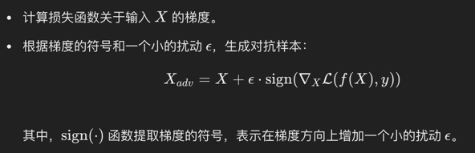
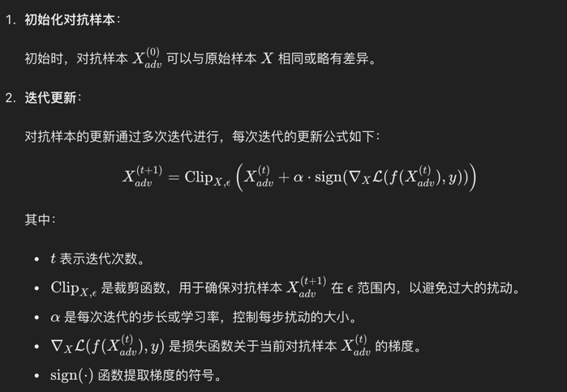
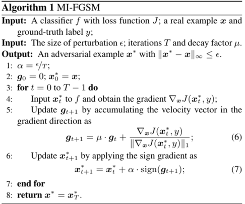
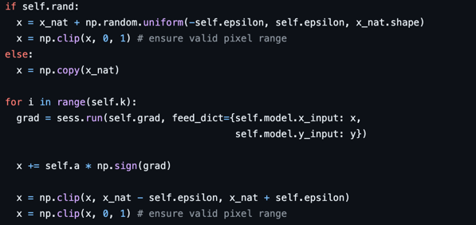
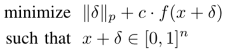
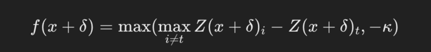
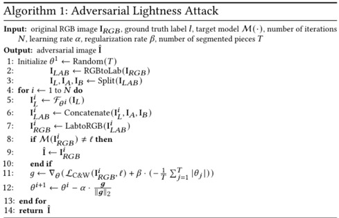

# Adversarial_Example_Attack

正在更新中，目前的仅有FGSM基于自定义的MNIST的攻击效果展示


# Usage
使用argparse
```shell
python config.py -m MNIST -d MNIST -a FGSM 
```
`-m` 为指定模型

`-d` 为指定数据集

`-a` 为指定攻击方式

# 模型
目前集成了`MNIST`、`CIFAR10`、`blip_caption`模型
+ `MNIST` 主要用于测试基础的classification任务
+ `CIFAR10` 主要用于测试如ALA攻击方式，需要RGB图像的任务
+ `blip_caption` 主要用于image_caption任务，通过blip模型来搭建基于image_caption的预测模型，可以根据对应的数据集(目前仅有`coco`)来生成图像描述

# 数据集
目前集成了`CIFAR10`、`COCO`、`MNIST`数据集
+ `MNIST` 数据集与`MNIST`模型匹配，用于测试classification在灰度图像上的表现效果
+ `CIFAR10` 数据集与`CIFAR10`模型匹配，用于测试classification在RGB图像上的表现效果
+ `COCO` 数据集与`blip_caption`模型匹配，用于测试image caption任务在不同攻击的表现效果

# 攻击方式
分为图像预处理方式(应该算是黑盒攻击)，与白盒攻击
## 黑盒攻击(图像与处理方式)
黑盒攻击方式是不知道网络结构时修改图像进行的攻击方式

分为噪声(noise)、模糊(blur)、天气、数字化 四大类
+ 噪声(noise)
  + 高斯噪声(attack_gaussian_noise)
  + 散粒噪声(attack_shot_noise)
  + 脉冲噪声(attack_impulse_noise)
  + 散斑噪声(attack_speckle_noise)
+ 模糊(blur)
  + 高斯模糊(attack_gaussian_noise)
  + 毛玻璃模糊(attack_glass_blur)
  + 变焦模糊(attack_zoom_blur)
  + 运动模糊(attack_motion_blur)
  + 散焦模糊(attack_defocus_blur)
+ 天气
  + 雪(attack_snow)
  + 雾(attack_fog)
  + 霜(attack_frost)
+ 数字化
  + 对比度(attack_contrast)
  + 亮度(attack_brightness)
  + 弹性(attack_elastic)
  + 像素化(attack_pixelate)
  + 饱和度(attack_saturate)

共17种攻击方式
  
参考[Benchmarking Robustness of Multimodal Image-Text Models under Distribution Shift
](https://mmrobustness.github.io/)

## 白盒攻击

白盒攻击方式是已知网络结构时根据网络结构计算出的梯度，来对当前图像进行更新

+ 受限的攻击方式(将攻击产生的扰动控制在特定的范围内)
  + FGSM(attack_FGSM):基于梯度的单次更新

  + IFGSM(attack_IFGSM):基于梯度的迭代攻击方式，在FGSM的基础上进行少量多次的梯度更新

  + MIFGSM(attack_MIFGSM):基于梯度和动量的迭代攻击方式,在IFGSM迭代的基础上增加了动量这一概念，让结果可以更快收敛

  + PGD(attack_PGD):在IFGSM的基础上增加了随机初始化的步骤，同时在每次迭代时限制扰动在规定范围内

  + CW
    + 分类任务(attack_CW_classification):核心是最小化下面的式子

      + 𝛿为原图与扰动图像的差距。求攻击前后两张图像的Lp范式
      + 𝑓(𝒙+𝛿)为预测结果，当结果<=0时代表预测错误

      + Zt为正确标签的logit值
      + Zi为除了正确标签以外的logit值
    + 图像描述任务(暂未成功实现，BLIP梯度回传暂时有点问题)
+ 未受限的攻击方式(对图像的扰动值不用控制在特定的数值范围之内)
  + ALA(亮度攻击)
    + 分类任务(attack_ALA_classification)

